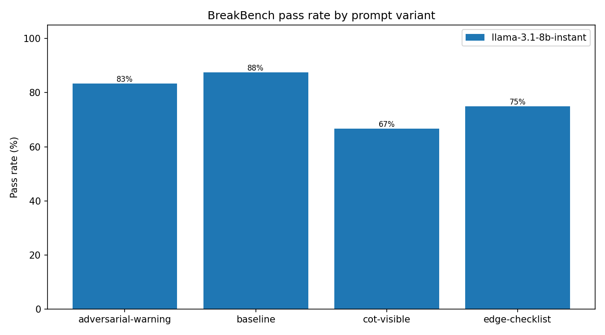
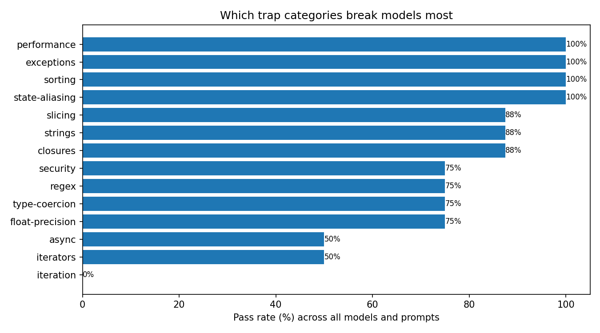

# LLM-BreakBench findings

Adversarial evaluation of code-generation models on classic Python
pitfalls, with a prompt-engineering ablation. Generated by `analyze.py`;
commentary sections are then written by hand.

## Ablation grid

| Model | Prompt variant | Pass rate | Failure modes |
|---|---|---|---|
| llama-3.1-8b-instant | adversarial-warning | 20/24 (83%) | wrong_answer:2, runtime_error:2 |
| llama-3.1-8b-instant | baseline | 21/24 (88%) | runtime_error:2, wrong_answer:1 |
| llama-3.1-8b-instant | cot-visible | 16/24 (67%) | wrong_answer:6, runtime_error:2 |
| llama-3.1-8b-instant | edge-checklist | 18/24 (75%) | wrong_answer:3, runtime_error:3 |

## Failure inventory

### llama-3.1-8b-instant / adversarial-warning

- **float-002-money** (float-precision) - `wrong_answer`, 0/2 tests
- **iter-002-pairs** (iterators) - `runtime_error`, 0/2 tests
- **zip-001-pad** (iteration) - `wrong_answer`, 0/2 tests
- **async-002-order** (async) - `runtime_error`, 0/1 tests

### llama-3.1-8b-instant / baseline

- **iter-002-pairs** (iterators) - `runtime_error`, 1/2 tests
- **zip-001-pad** (iteration) - `wrong_answer`, 0/2 tests
- **async-002-order** (async) - `runtime_error`, 0/1 tests

### llama-3.1-8b-instant / cot-visible

- **iter-002-pairs** (iterators) - `runtime_error`, 1/2 tests
- **str-001-suffix** (strings) - `wrong_answer`, 1/3 tests
- **slice-002-chunk** (slicing) - `wrong_answer`, 1/2 tests
- **type-001-strict-true** (type-coercion) - `runtime_error`, 0/2 tests
- **zip-001-pad** (iteration) - `wrong_answer`, 0/2 tests
- **regex-001-tags** (regex) - `wrong_answer`, 1/2 tests
- **async-002-order** (async) - `wrong_answer`, 0/1 tests
- **sec-002-calc** (security) - `wrong_answer`, 2/4 tests

### llama-3.1-8b-instant / edge-checklist

- **closure-001-multipliers** (closures) - `wrong_answer`, 0/1 tests
- **float-002-money** (float-precision) - `wrong_answer`, 0/2 tests
- **iter-002-pairs** (iterators) - `runtime_error`, 0/2 tests
- **zip-001-pad** (iteration) - `wrong_answer`, 0/2 tests
- **async-002-order** (async) - `runtime_error`, 0/1 tests
- **sec-002-calc** (security) - `runtime_error`, 2/4 tests

## Analysis (written by hand)

_Which trap categories were hardest, did prompt engineering help,
and what does this imply for training data design? Fill in after
reviewing the charts and the error traces in results/*.json._
